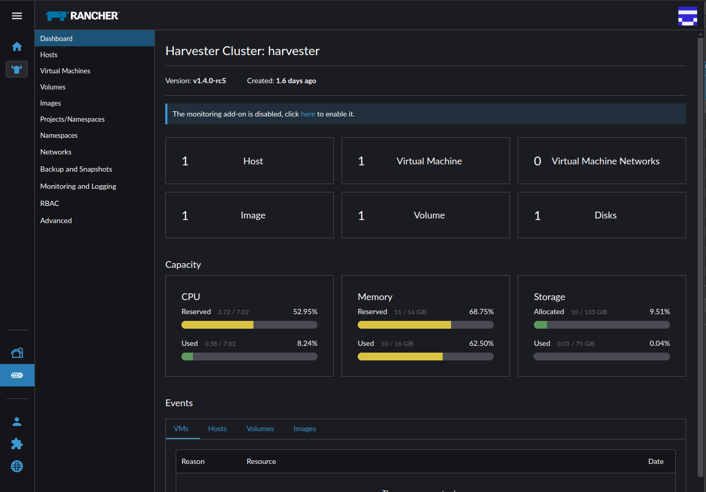

# Rancher Extension Microfrontend

## Goals

- Build a project to install Rancher Extensions, based on microfrontend pattern.
- Flexibility - decouple technologies used in Rancher Dashboard and Extensions.
- Reusability - apply the new pattern to any of the Extensions in Rancher catalog.

## Use case

- The Rancher dashboard has been migrated from the Vue 2 UI framework to the Vue 3 framework, in version 2.10; extensions and plugins based on Vue2 are no more supported.
- Users running Rancher 2.9 will be not able to continue using the Harvester plugin in Rancher 2.10.
- The Harvester team has now to support both 2.9 and 2.10 compatible Harvester versions.
- A possible solution is to use a Harvester microfrontend, which would be compatible regardless of the Rancher version.

## Project Structure

- [host](./host/) contains a Rancher Dashboard based on 2.10 (Vue3) plus features to load and access to the Harvester microfrontend.
- [remote](./remote/) contains a Harvester Dashboard based on v1.3.2 (Vue2).
- [microfrontend](./charts/microfrontend) is the Helm charts to install the Harvester microfrontend in Rancher.

## Usage

1. Install Harvester Microfrontend

    ```
    helm install harvester charts/microfrontend
    ```

2. Go to Virtualization Management and import a Harvester cluster

3. Click on Harvester cluster's name, when active.

<br/>

